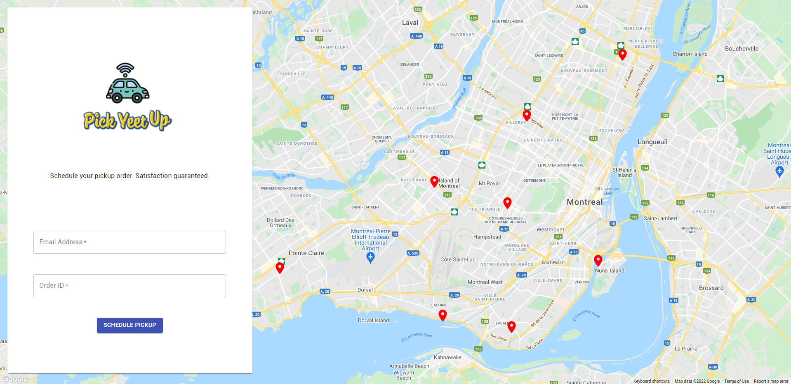
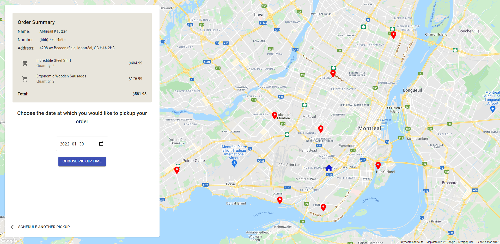
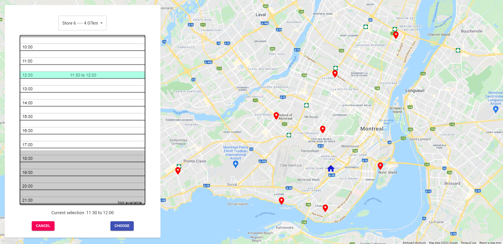

 

  

  <h3 align="center">Pick Yeet Up</h3>

  

    Web application aimed to revolutionize the scheduling of pick-up orders! 🚗💨
  

 

## Inspiration
During this pandemic, we have seen many changes in our day-to-day lives. Moving towards an online world has made it hard to schedule activities. For example, we had to go through endless dropdowns simply to make a reservation to go to the gym. As such, we here at **Pick Yeet Up** are aiming to revolutionize the way we schedule by making the experience as intuitive as possible.

## What it does
Pick Yeet Up is a web app that allows customers to schedule the pick-up of their order. Using Google's API and the information of the customer, our application is able to smartly determine the best pick-up spot without having to enter any additional information! Beyond that, we have created our own time-picking interface that is both intuitive and informative.

## How we built it
Our solution is simplistic and makes maximum use of the API provided by **SAP**. The frontend is built using React with Node.js. For storage, we are using a combination of localStorage and Firebase.

## Challenges we ran into
Working with Google's Map API was new to us and we spent countless hours debugging before landing with a nice UI/UX. We've also faced difficulty finding a suitable solution to the scheduling problem. It is a hard task in terms of logistics. However, with diligent brainstorming and multiple mocks, we finally landed a solution that we are satisfied with.

## Accomplishments that we're proud of
Our team is proud to deliver a project that we would happily see on the market!

## What we learned
We learned a lot about the complexity of scheduling systems such as the features involved. We also learned a lot about Google's Map API through many trials and errors. Finally, while making this application we learned the true power of friendship.

## What's next for Pick Yeet Up
Many features are on the way. Such as a mobile version of the app, better pick-up time suggestions to optimize the time of employees, automatic scheduling based on historical data and so much more.

## Contributors
| Name                   | Github                                                |
|------------------------|-------------------------------------------------------|
| Phong Le               | [phong1233](https://github.com/phong1233)             |
| Sébastien Blain-Nadeau | [sebastien-blain](https://github.com/sebastien-blain) |
| Kevin Jiang            | [kevjiang64](https://github.com/kevjiang64) |